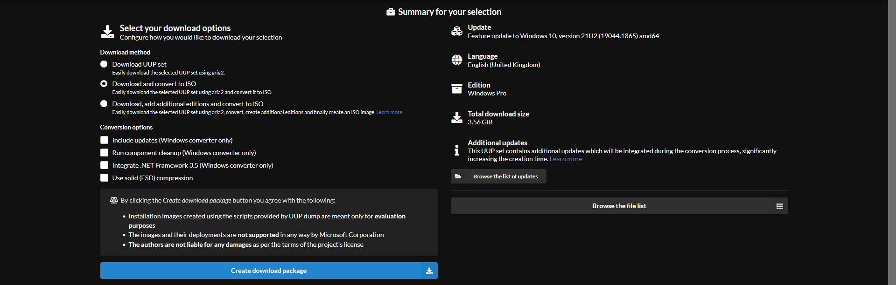

# Build Instructions

## Build Requirements

- [7-Zip](https://www.7-zip.org)

- [win-wallpaper](https://github.com/amitxv/win-wallpaper/releases)

    - Place the program in ``C:\Windows``

- Deployment Tools from the [Windows ADK](https://docs.microsoft.com/en-us/windows-hardware/get-started/adk-install)

- Latest Servicing Stack Update for the host machine

    - Configuring an image while the host's DISM version is outdated will likely result in errors. Manually search & download the latest SSU from the [Microsoft update catalog](https://www.catalog.update.microsoft.com/Home.aspx). Once downloaded, extract the .cab from the .msu & use the command below to apply it to the host machine

        ```bat
        DISM /Online /Add-Package /PackagePath=<path\to\latest\ssu>
        ```

## Downloading Stock Images

The recommended links & methods below will ensure that we can work with a base image with no additional updates. Ensure to cross-check the hashes for the image to verify that the image is genuine & not corrupted (not required when building an image from UUP dump). Use the command ``certutil -hashfile <path\to\file>`` to get the hash of the ISO file

Generally, Windows 7 is superior for real-time tasks compared to its successors but lacks USB & NVME driver support for newer hardware. Earlier versions of Windows lack GPU driver & anticheat support so some users are forced on newer builds. Microsoft implemented a fixed 10mHz QueryPerformanceFrequency on Windows 10 1809+ which was intended to make developing applications easier but many users reported worse performance. Windows 10 1903+ has an updated scheduler for multi CCX Ryzen CPUs [[1](https://i.redd.it/y8nxtm08um331.png)]. Microsoft changed how timer resolution functions as explained in [this article](https://randomascii.wordpress.com/2020/10/04/windows-timer-resolution-the-great-rule-change/) on Windows 10 2004+ & was [further developed in Windows 11](../media/windows11-timeapi-changes.png) which I assume is an attempt to improve power efficiency


<details>
<summary>Windows 7</summary>

- **en_windows_7_professional_with_sp1_x64_dvd_u_676939.iso**

    - [link 1](https://isofiles.bd581e55.workers.dev/Windows%207/Windows%207%20Professional%20with%20SP1/en_windows_7_professional_with_sp1_x64_dvd_u_676939.iso), [link 2](https://msnp0-my.sharepoint.com/personal/tuanthanh1_p0_msnvn_org/_layouts/15/download.aspx?SourceUrl=%2Fpersonal%2Ftuanthanh1%5Fp0%5Fmsnvn%5Forg%2FDocuments%2FWindows%2FWindows%207%2Fen%5Fwindows%5F7%5Fprofessional%5Fwith%5Fsp1%5Fx64%5Fdvd%5Fu%5F676939%2Eiso)
    
    - [Adguard image hashes](https://files.rg-adguard.net/file/11ad6502-c2aa-261c-8c3f-c81477b21dd2)

</details>

<details>
<summary>Windows 8</summary>

- **en_windows_8.1_with_update_x64_dvd_6051480.iso**

    - [link 1](https://isofiles.bd581e55.workers.dev/Windows%208/Windows%208.1%20with%20Update/en_windows_8.1_with_update_x64_dvd_6051480.iso), [link 2](https://msnp0-my.sharepoint.com/personal/tuanthanh1_p0_msnvn_org/_layouts/15/download.aspx?SourceUrl=%2Fpersonal%2Ftuanthanh1%5Fp0%5Fmsnvn%5Forg%2FDocuments%2FWindows%2FWindows%208%2E1%2Fen%5Fwindows%5F8%2E1%5Fwith%5Fupdate%5Fx64%5Fdvd%5F6051480%2Eiso)

    - [Adguard image hashes](https://files.rg-adguard.net/file/feeb8cae-fb0b-42b9-6f69-50c71f0e5415)

</details>

<details>
<summary>Windows 10+</summary>
<br>

Since it is quite tedious to obtain a Windows 10+ image with minimal updates, we can build our own using [UUP dump](https://uupdump.net)

- Search for the Windows version you desire & download the latest instance
   
    

- Choose the desired language & click next

    

- Uncheck all editions except the professional edition & click next

    

- Copy the configuration below, ensure include updates is checked & click create download package

    

- Extract the downloaded package & run **uup_download_windows.cmd**. The final ISO file will be created in the same directory as the script

</details>

## Preparing the Build Environment

- Extract the contents of the .ISO to a directory of your choice with 7-Zip, In the examples below, I am using ``C:\Win10_21H2_English_x64``

- Open CMD as administrator & configure these variables below. These variables are temporary for this session & will be discarded if you close the terminal window so ensure to keep it open throughout the build process

    ```bat
    set "EXTRACTED_IMAGE=C:\Win10_21H2_English_x64"
    set "MOUNT_DIR=C:\temp"
    set "OSCDIMG=C:\Program Files (x86)\Windows Kits\10\Assessment and Deployment Kit\Deployment Tools\amd64\Oscdimg\oscdimg.exe"

    if exist "%MOUNT_DIR%" (rd /s /q "%MOUNT_DIR%")
    mkdir "%MOUNT_DIR%"
    ```

- If the environment was configured correctly, the commands below should return **true**

    ```bat
    if exist "%EXTRACTED_IMAGE%\sources\install.wim" (echo true) else (echo false)
    if exist "%MOUNT_DIR%" (echo true) else (echo false)
    if exist "%OSCDIMG%" (echo true) else (echo false)
    where win-wallpaper.exe > nul 2>&1 && echo true || echo false
    ```

## Stripping Non-Essential Editions

- Remove every edition except the desired edition (professional edition recommended), by retrieving the indexes of every other edition & removing it with the commands below. Once completed, the only edition to exist should be the desired edition at index 1

    ```bat
    DISM /Get-WimInfo /WimFile:"%EXTRACTED_IMAGE%\sources\install.wim"
    DISM /Delete-Image /ImageFile:"%EXTRACTED_IMAGE%\sources\install.wim" /Index:<index>
    ```

## Mounting the Image

- Mounting the image with the command below will allow us to carry out a few tasks

    ```bat
    DISM /Mount-Wim /WimFile:"%EXTRACTED_IMAGE%\sources\install.wim" /Index:1 /MountDir:"%MOUNT_DIR%"
    ```

## Integrating Updates

- Windows 7 recommended updates:

    You may not need all updates listed below depending on your needs, if you are unsure then integrate all mentioned

    ```
    KB4490628 - Servicing Stack Update
    KB4474419 - SHA-2 Code Signing Update
    KB2670838 - Platform Update & DirectX 11.1
    KB2990941 - NVME Support
    KB3087873 - NVME Support & Language Pack Hotfix
    KB2864202 - KMDF Update (required for USB 3/XHCI driver stack)
    KB4534314 - Easy Anti-Cheat Support
    ```

- Windows 8 recommended updates:

    - Download the latest, non-security cumulative update along with the servicing stack for that specific update (specified in the update page). The update page should also specify if the update is non-security or a security update, if it does not, then download the latest update. Use the official [Windows 8 update history page](https://support.microsoft.com/en-us/topic/july-21-2016-kb3172614-dcf9bea5-47b0-b574-2929-4f9e130f5192)

- Windows 10+ recommended updates:

    - Download the latest, non-security cumulative update along with the servicing stack for that specific update (specified in the update page). The update page should also specify if the update is non-security or a security update, if it does not, then download the latest update. Use the official [Windows 10 update history page](https://support.microsoft.com/en-us/topic/windows-10-update-history-93345c32-4ae1-6d1c-f885-6c0b718adf3b)

- Download the updates from the [microsoft update catalog](https://www.catalog.update.microsoft.com/Home.aspx) by searching for the KB identifier. Place the updates somewhere easily accessible such as ``C:\updates``

- Integrate the updates into the mounted image with the command below. The servicing stack must be installed before installing the cumulative updates

    ```bat
    DISM /Image:"%MOUNT_DIR%" /Add-Package /PackagePath=<path\to\update>
    ```

## Enable .NET 3.5 (Windows 8+)

```bat
DISM /Image:"%MOUNT_DIR%" /Enable-Feature /FeatureName:NetFx3 /All /LimitAccess /Source:"%EXTRACTED_IMAGE%\sources\sxs"
```

## Enable Legacy Components for older games (Windows 8+)

```bat
DISM /Image:"%MOUNT_DIR%" /Enable-Feature /FeatureName:DirectPlay /All
 ```

## Integrating & Obtaining Drivers

This step is generally required for users installing Windows 7 to integrate USB & NVME drivers so that setup can proceed

- You can usually find drivers by searching or asking others for drivers that are compatible with your device HWID

    - See [media/device-hwid-example.png](../media/device-hwid-example.png)

- [Win-Raid USB driver collection](https://winraid.level1techs.com/t/usb-3-0-3-1-drivers-original-and-modded/30871).

    - If you can not find a USB driver, try using the [generic USB driver](https://forums.mydigitallife.net/threads/usb-3-xhci-driver-stack-for-windows-7.81934/)

- [Win-Raid AHCI & NVME driver collection](https://winraid.level1techs.com/t/recommended-ahci-raid-and-nvme-drivers/28310).

- Place all of the drivers to be integrated somewhere easily accessible such as ``C:\drivers`` & use the command below to integrate them into the mounted image

```bat
DISM /Image:"%MOUNT_DIR%" /Add-Driver /Driver:"C:\drivers" /Recurse /ForceUnsigned
```

## Integrating Required Files

- Open the mounted directory with the command below

    ```bat
    explorer "%MOUNT_DIR%"
    ```

- Clone the repository & place the **prerequisites** folder & **win-debloat.sh**  in the mounted directory

## Remove Provisioned Appx Bloatware (Windows 8+)

- This command removes the majority of Windows apps such as Microsoft store, maps, camera etc that nobody uses & potentially jeopardizes privacy

    ```bat
    for /f "tokens=3" %i in ('DISM /Image:"%MOUNT_DIR%" /Get-ProvisionedAppxPackages ^| findstr "PackageName"') do (DISM /Image:"%MOUNT_DIR%" /Remove-ProvisionedAppxPackage /PackageName:%i)
    ```

## Replacing Wallpapers

- Run the command below to replace all backgrounds & user profile images with solid black images. Use the **--win7** argument if building Windows 7

    ```bat
    win-wallpaper.exe --dir "%MOUNT_DIR%" --rgb #000000
    ```

## Unmount & Commit

- Run the command below twice to save the changes to the mounted image

    ```bat
    DISM /Unmount-wim /MountDir:"%MOUNT_DIR%" /Commit
    ```

- Delete the mount dir folder

    ```bat
    rd /s /q "%MOUNT_DIR%"
    ```

## Replace Windows 7 Boot Wim (Windows 7)

As you are aware, Windows 7 lacks driver support for modern hardware & you should have already integrated drivers into the **install.wim** however we have not yet touched the **boot.wim** (installer). We could integrate the same drivers into the **boot.wim** as we did before however this may still lead to a problematic installation. Instead, we can use the Windows 10 **boot.wim** which already has modern hardware support to install our Windows 7 **install.wim**

- Download the [latest Windows 10 image](https://www.microsoft.com/en-gb/software-download/windows10) & extract it, I would recommend renaming the extracted folder to avoid confusion. In the examples below, I have extracted it to ``C:\W10_image``

- Replace ``sources\install.wim`` or ``sources\install.esd`` in the extracted Windows 10 image with the Windows 7 **install.wim**

- We need to update a variable since our extracted directory has changed. Enter the path of your new extracted directory, mine is ``C:\W10_image``

    ```bat
    set "EXTRACTED_IMAGE=C:\W10_image"
    ```

## Insert DISM Apply-Image Script

Use the command below to open the extracted directory, place the **install.bat** script in the directory

```bat
explorer "%EXTRACTED_IMAGE%"
```

## Image compression (Optional)

Use the command below to compress the image, this may take a while

```bat
DISM /Export-Image /SourceImageFile:"%EXTRACTED_IMAGE%\sources\install.wim" /SourceIndex:1 /DestinationImageFile:"%EXTRACTED_IMAGE%\sources\install.esd" /Compress:recovery /CheckIntegrity && del /f /q "%EXTRACTED_IMAGE%\sources\install.wim"
```

## Convert to ISO

- Use the command below to convert the extracted image to an iso which will be created on the Desktop

```bat
"%OSCDIMG%" -m -o -u2 -udfver102 -l"final_iso" -bootdata:2#p0,e,b"%EXTRACTED_IMAGE%\boot\etfsboot.com"#pEF,e,b"%EXTRACTED_IMAGE%\efi\microsoft\boot\efisys.bin" "%EXTRACTED_IMAGE%" "%userprofile%\Desktop\final_iso.iso"
```
