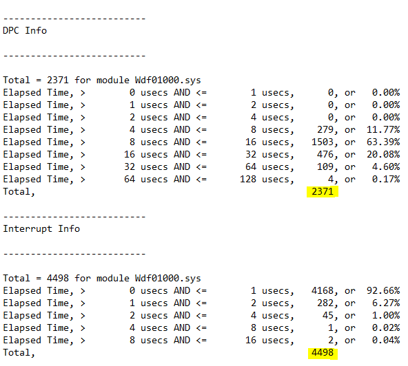
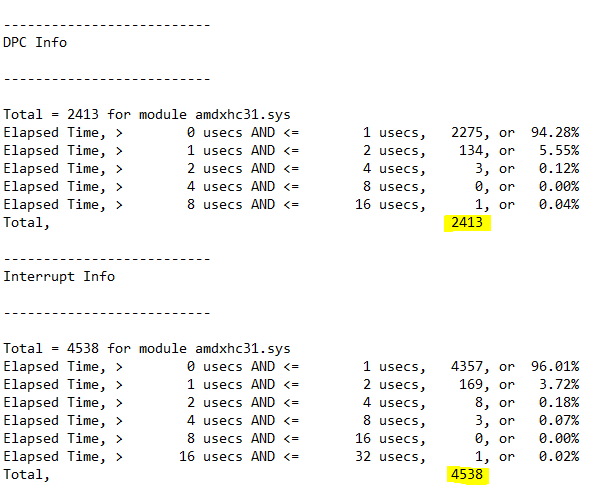

# Research

#### How can you verify if a DSCP QoS policy is working?

<details>

<summary>Read More</summary>

- Download and install [Microsoft Network Monitor 3.4](https://www.microsoft.com/en-us/download/details.aspx?id=4865)
   
- Create a new capture
   
    

- Open a game that you have applied a DSCP value for and enter a game mode in which the game will send and receive packets (e.g an online match, not a local match)
   
- Press F5 to start logging. After 30 seconds or so press F7 to stop the log
   
- In the left hand pane, click on the game executable name and click on a packet header. Expand the packet info under **Frame Details** and finally expand the subcategory **Ipv4**. This will reveal the current DSCP value of each frame

    

</details>

---

#### What TscSyncPolicy does Windows use by default?

<details>

<summary>Read More</summary>
<br>

After searching through the decompiled **ntoskrnl.exe** pseudocode in [Hex-Rays IDA](https://hex-rays.com/products/idahome/), I noticed that **HalpTscSyncPolicy** is changed when **TscSyncPolicy** is configured by modifying the BCD store. Despite many claims of enhanced being the default value, there has no been evidence so I decided to find out myself.

We can read **HalpTscSyncPolicy** in a local kernel debugger such as [WinDbg](https://docs.microsoft.com/en-us/windows-hardware/drivers/debugger/debugger-download-tools) in real-time to find out the different values it returns with different bcd store configurations.

**bcdedit.exe /deletevalue tscsyncpolicy** (Windows default)

```
lkd> dd HalpTscSyncPolicy l1
fffff801`2de4a3ac  00000000
```
**bcdedit.exe /set tscsyncpolicy default**

```
lkd> dd HalpTscSyncPolicy l1
fffff803`1dc4a3ac  00000000
```
**bcdedit.exe /set tscsyncpolicy legacy**

```
lkd> dd HalpTscSyncPolicy l1
fffff805`1dc4a3ac  00000001
```
**bcdedit.exe /set tscsyncpolicy enhanced**

```
lkd> dd HalpTscSyncPolicy l1
fffff802`2864a3ac  00000002
```

Conclusion: By default, Windows uses the **default** value, not **enhanced** or **legacy**. Although, the **default** value may correspond to another value which is not exposed by reading the output of **HalpTscSyncPolicy**.

</details>

---

#### How many RSS Queues do you need?

<details>

<summary>Read More</summary>
<br>

[Receive side scaling (RSS) is a network driver technology that enables the efficient distribution of network receive processing across multiple CPUs in multiprocessor systems](https://docs.microsoft.com/en-us/windows-hardware/drivers/network/introduction-to-receive-side-scaling). The amount you should use or need depends on your typical network load. In server environments, a large amount of RSS queues is desirable as receive processing delays will be reduced and ensures that no CPU is heavily loaded. The same concept can be applied to games however the network load differs significantly making it an invalid comparison so I decided to carry out some experiments myself.

I simulated Valorant's network traffic in iperf using two machines (~300kb/s receive in deathmatch) and monitored the network driver's activity in xperf. Please note that RssBaseProcessor is set to 0, so theoretically, CPU 0 and CPU 1 should be handling DPCs/ISRs for ndis.sys.


I noticed that despite having RSS queues set to 2, only CPU 1 was primarily handling interrupts for the driver which I assume was due to such little traffic. So I decided to re-test with the same configuration. However, this time I simulated 1Gbps network traffic to verify this.


As expected, this scenario demonstrates that both CPU 0 and CPU 1 are handling DPCs/ISRs for ndis.sys.

Conclusion: During online matches, at most two RSS queues/cores are being utilized. However, there is no harm in using more than two but it is important to be aware of the information above as people reserve consecutive cores specifically for the network driver when those core(s) could better be used for another driver or a real-time application. The amount of RSS queues a network adapter has may also determine the quality of the hardware but this is yet to be explored but something to keep in mind.

</details>

---

#### Win32PrioritySeparation

- #### The truth behind ambiguous values

    <details>

    <summary>Read More</summary>
    <br>
    
    According to the documentation Windows allows up to 0x3F (63 decimal) because the bitmask is made up of 6-bits, so why do values above this exist? what happens if we enter a value greater than the (theoretically) maximum allowed?

    We can read PsPrioritySeparation and PspForegroundQuantum in a local kernel debugger such as WinDbg in real-time and use the quantum index provided in the Windows internals book to find out the different values it returns with different Win32PrioritySeparation entries.

    | PsPrioritySeparation | Foreground boost |
    |----------------------|------------------|
    | 2                    | 3:1              |
    | 1                    | 2:1              |
    | 0                    | 1:1              |

    

    Demonstration with the Windows default, **0x2 (2 decimal)**

    ```
    lkd> dd PsPrioritySeparation L1
    fffff802`3a6fc5c4  00000002

    lkd> db PspForegroundQuantum L3
    fffff802`3a72e874  06 0c 12
    ```
    PspForegroundQuantum returns the values in hexadecimal so we need to convert it to decimal in order to use the tables correctly. ``06 0c 12`` is equivalent to ``6 12 18`` and PsPrioritySeparation returns ``2``. In the tables, this corresponds to short, variable, 3:1. But we already knew this as it is documented by Microsoft, so now lets try an ambiguous value.

    **0xffff3f91 (4294918033 decimal)**

    ```
    lkd> dd PsPrioritySeparation L1
    fffff802`3a6fc5c4  00000001

    lkd> db PspForegroundQuantum L3
    fffff802`3a72e874  0c 18 24
    ```

    ``0c 18 24`` is equivalent to ``12 24 36`` and PsPrioritySeparation returns ``1`` which corresponds to long, variable, 2:1. Nothing special as it seems, this is actually equivalent to values less than the maximum documented value as shown in [this csv](https://raw.githubusercontent.com/djdallmann/GamingPCSetup/master/CONTENT/RESEARCH/FINDINGS/win32prisep0to271.csv). I had the same results while testing various other values.

    Conclusion: Why does Windows allow us to enter values greater than 0x3F (63 decimal) if any value greater than this is equivalent to values less than the maximum documented value? The reason behind this is because the maximum value for a REG_DWORD is 0xFFFFFFFF (4294967295 decimal) and there are no restrictions in place to prevent users to entering a illogical value, so when the kernel reads the Win32PrioritySeparation registry key, it must account for invalid values so it only reads a portion of the entered value. The portion it chooses to read is the first 6-bits of the bitmask which means values greater than 63 are recurring values. The table below consists of all possible values (consistent between client and server editions of Windows as **00** or **11** were not used in **AABB**CC in the bitmask which have different meanings on client/server). The time in milliseconds are based on the modern x86/x64 multiprocessor clock interrupt frequency.

    | **Hexadecimal** | **Decimal** | **Binary** | **Interval** | **Length** | **Foreground QU** | **Background QU** | **Foreground Time (Ms)** | **Background Time(Ms)** |
    |-----------------|-------------|------------|--------------|------------|-------------------|-------------------|--------------------------|-------------------------|
    | 0x14            | 20          | 010100     | Long         | Variable   | 12                | 12                | 62.50                    | 62.50                   |
    | 0x15            | 21          | 010101     | Long         | Variable   | 24                | 12                | 125.00                   | 62.50                   |
    | 0x16            | 22          | 010110     | Long         | Variable   | 36                | 12                | 187.50                   | 62.50                   |
    | 0x18            | 24          | 011000     | Long         | Fixed      | 36                | 36                | 187.50                   | 187.50                  |
    | 0x24            | 36          | 100100     | Short        | Variable   | 6                 | 6                 | 31.25                    | 31.25                   |
    | 0x25            | 37          | 100101     | Short        | Variable   | 12                | 6                 | 62.50                    | 31.25                   |
    | 0x26            | 38          | 100110     | Short        | Variable   | 18                | 6                 | 93.75                    | 31.25                   |
    | 0x28            | 40          | 101000     | Short        | Fixed      | 18                | 18                | 93.75                    | 93.75                   |

    </details>

- #### No foreground boost may be superior

    <details>

    <summary>Read More</summary>
    <br>

    Out of the box, Windows uses 0x2 (2 decimal) which (in terms of foreground boosting) means that the threads of foreground processes get three times as much processor time than the threads of background processes each time they are scheduled for the processor. While this is theoretically desirable when playing a game for example, we need to pause for a moment and think about the potential damage this may be doing.
    
    We can view the QuantumReset value in a local kernel debugger such as [WinDbg](https://docs.microsoft.com/en-us/windows-hardware/drivers/debugger/debugger-download-tools) in real-time to check what a process's share of the total quantum is.

    ```
    QuantumReset is the default, full quantum of each thread on the system when it
    is replenished This value is cached into each thread of the process, but the KPROCESS
    structure is easier to look at 
    ```

    A script must be used as a sleep delay is required so that the a window can be brought to the front and be made the foreground process.

    Script.txt contents

    ```
    .sleep 1000
    dt nt!_KPROCESS <address> QuantumReset
    ```

    ---
    
    **Valorant** (game)

    ```
    lkd> $$>a< "script.txt"
        +0x281 QuantumReset : 18 ''
    ```

    **Csrss** (responsible for input)

    ```
    lkd> $$>a< "script.txt"
        +0x281 QuantumReset : 6 ''
    ```

    **System** (Windows kernel)

    ```
    lkd> $$>a< "script.txt"
        +0x281 QuantumReset : 6 ''
    ```

    **Audiodg** (Windows audio)

    ```
    lkd> $$>a< "script.txt"
        +0x281 QuantumReset : 6 ''
    ```

    As you can see above, despite their importance, the game gets three times more CPU times than csrss, kernel and audio threads which can be problematic. If we use no foreground boost, all processes will get as much CPU time as each other (see below). The same result can be achieved with a fixed quantum because it automatically implies no foreground boost can be used

    **Valorant** (game)

    ```
    lkd> $$>a< "script.txt"
        +0x281 QuantumReset : 6 ''
    ```

    **Csrss** (responsible for input)

    ```
    lkd> $$>a< "script.txt"
        +0x281 QuantumReset : 6 ''
    ```

    **System** (Windows kernel)
    ```
    lkd> $$>a< "script.txt"
        +0x281 QuantumReset : 6 ''
    ```

    </details>

---

#### Microsoft USB driver latency penalty 

<details>

<summary>Read More</summary>
<br>

On a stock Windows 10 installation, the Wdf01000.sys driver handles USB connectivity but using it comes with a major latency penalty compared to using vendor USB drivers.

**Wdf01000.sys**



**amdxhc31.sys** (vendor USB drivers)



Excluding benchmark variation, ISR/DPC count and ISR latency is identical. However, with the vendor drivers, DPC latency was positively impacted and for this reason it would be appropriate to update the USB driver if applicable but your mileage may vary so feel free to benchmark it on your own system.

</details>

<!-- #### Title

<details>

<summary>Read More</summary>
<br>

</details> -->
